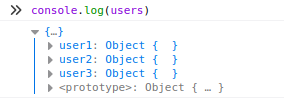
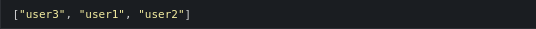
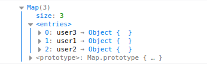

# ⚡ Map vs Object

**Map** adalah kumpulan data yang disimpan dalam bentuk _key-value pair_. Map sama seperti Object, namun beberapa hal yang membedakan dua tipe data ini adalah cara penggunaan dan karakteristiknya.

## 🎭 Karakteristik

Secara singkat, sebuah Object memiliki karakteristik tidak bisa di-loop secara langsung dan data yang disimpan memiliki urutan yang kurang jelas. Sedangkan Map memiliki karakteristik bisa di-loop secara langsung dan data yang disimpan di dalamnya memiliki urutan yang jelas, sesuai dengan index dari data yang disimpan.

### 🍡 Regular Object

```javascript
/**
 * Regular Object
 */
const users = {};

users['user3'] = {}; // data user3
users['user1'] = {}; // data user1
users['user2'] = {}; // data user2
```

Jika kita lihat `users` pada browser console, maka datanya akan terlihat seperti ini:



Sedangkan jika menggunakan `Object.keys()` hasilnya adalah keys dari Object `users` memiliki urutan yang sama seperti script diatas.



### 🍢 Map Object

```javascript
/**
 * Map
 */
const users = new Map();

users.set('user3', {}); // data user3
users.set('user1', {}); // data user1
users.set('user2', {}); // data user2
```

Jika `users` ditampilkan pada console, maka hasilnya seperti ini:



## 👨‍💻 Penggunaan

## 💡 Kesimpulan

## ⚓ Referensi

-   https://www.stefanjudis.com/today-i-learned/property-order-is-predictable-in-javascript-objects-since-es2015/
