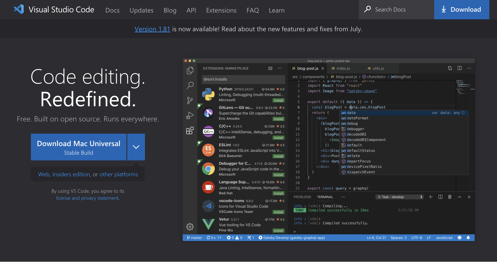
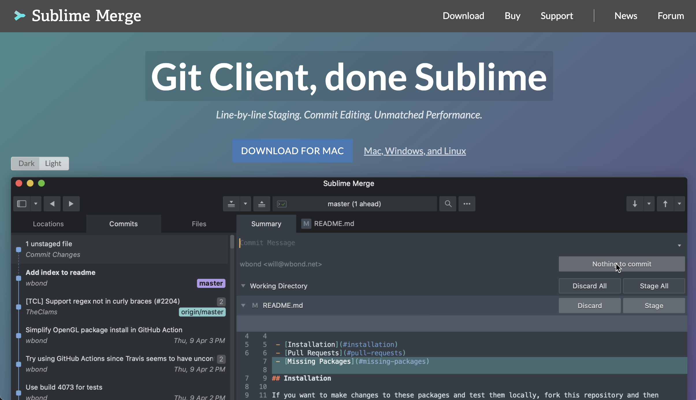
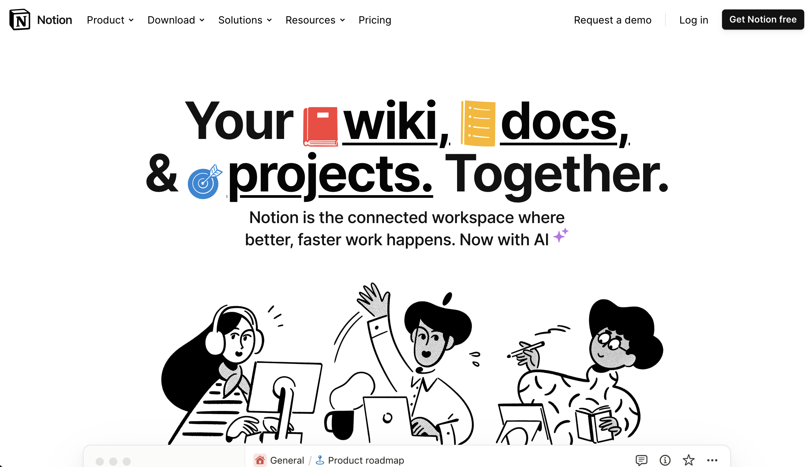
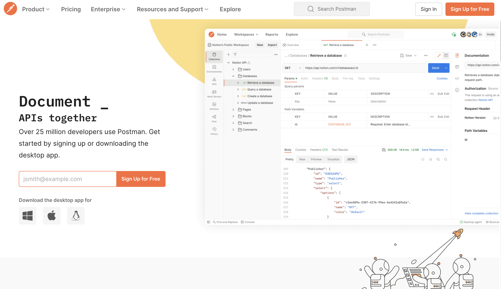

# 🧰 Rekomendasi Aplikasi Produktivitas

Catatan ini merangkum aplikasi yang dapat kamu gunakan untuk mendukung
produktivitas mu saat bekerja. Aplikasi yang dimaksud adalah aplikasi pendukung
seperti code editor, pembuat catatan, dll.

## VSCode

Open-source code editor yang tersedia di berbagai jenis platform
(cross-platform) yang didukung dengan segudang extension yang dapat diunduh
secara gratis pada [VSCode Marketplace](https://marketplace.visualstudio.com/vscode).

Selain itu, kita bisa custom 💅 sesuai dengan selera. Misalnya, kita bisa
mengubah tema, fonts, dll.

Berikut ini adalah beberapa extension yang saya gunakan:

- [Prettier](https://marketplace.visualstudio.com/items?itemName=esbenp.prettier-vscode)
- [:emojisense:](https://marketplace.visualstudio.com/items?itemName=bierner.emojisense)
- [GitLens](https://marketplace.visualstudio.com/items?itemName=eamodio.gitlens)

## Sublime Merge

Sederhananya, [Sublime Merge](https://www.sublimemerge.com/) bisa disebut
sebagai Git yang memiliki tampilan. Kita tahu kalau Git dioperasikan menggunakan
command-line based. Artinya kita harus menggunakan aplikasi seperti Terminal
atau CMD.

Command yang ada pada Git juga beragam, dan saya tidak bisa menghapalkan
semuanya. Maka dari itu, Sublime Merge sangant membantu sekali dalam hal
mengoperasikan Git. Cukup klik dan kode yang sudah kita buat dapat di-push ke
GitHub Repository ✨.

## Notion

Ini adalah aplikasi favorit saya! [Notion](https://www.notion.so/) menawarkan
kita all-in-one tools untuk membuat catatan, project management, dan dokumentasi
sekalipun. Yang menarik adalah, catatan mu bisa dieskpor menajdi PDF yang bisa
digunakan sebagai dokumentasi internal bila diperlukan.

Selain itu Notion juga mendukung untuk embed website seperti Codepan, Trello,
Drive, GitHub, dan masih banyak lagi. Bagi kamu yang suka menggunakan AI 🤖,
Notion juga menawarkan fitur AI yang bisa digunakan secara gratis!

## Postman

Testing API bisa jadi mudah pakai [Postman](https://postman.com) 🚀, lho!

Dulu, mungkin kita testing API yang dibuat menggunakan aplikasi seperti cURL 😨
yang semuanya dijalankan menggunakan command-line. Setelah testing API yang
dibuat, maka kita harus membuat dokumentasi dari API tersebut (ugh 🫠).

Tapi dengan hadirnya Postman, kita bisa testing dan membuat dokumentasinya
sekaligus. Keren banget! 😎
